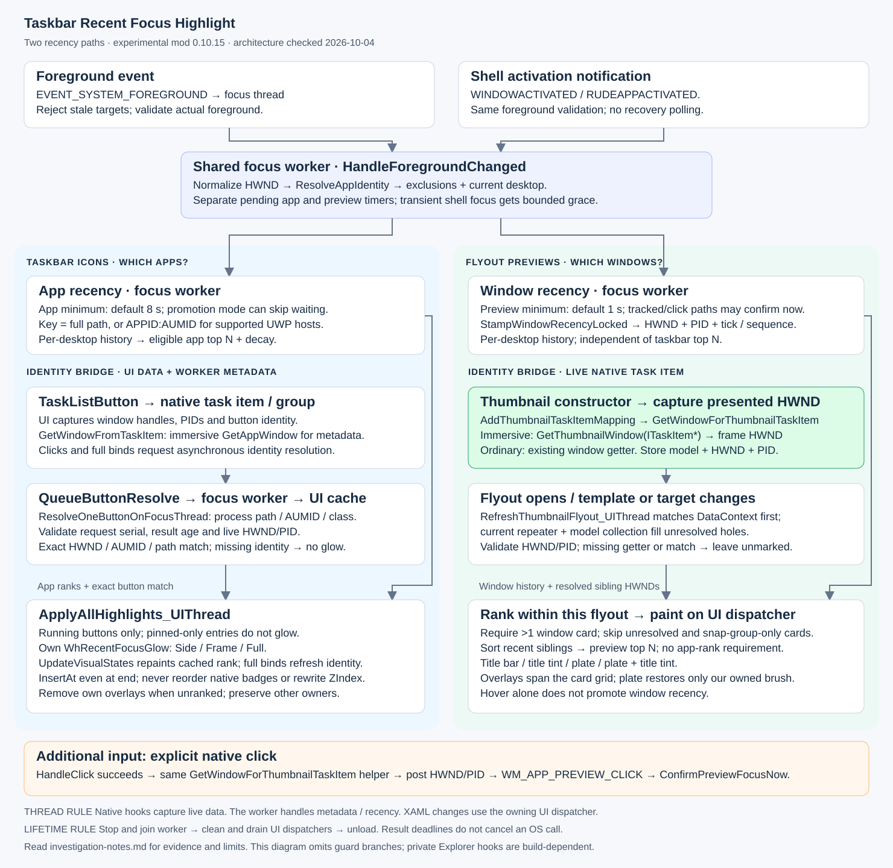

# What we learned: identities, previews, and regression testing

Updated 2026-10-04. Describes mod **0.10.13**, with the Calculator test harness
at commit `23fac66`. This is a findings and evidence summary, not a claim of
compatibility with every Explorer build or taskbar theme.

Follow-up: the [focus hook static audit](focus-hook-static-analysis.md) found a
distinct XAML thumbnail click route not covered by the current HandleClick
hook, and candidate native activation notifications. These are investigative
findings, not implemented changes or an explanation of the missing WinEvent.

The diagram is an overview. Settings, exclusions, handle validation, decay and
shutdown still apply to the paths shown. Its editable source is
[`generate-runtime-flow.py`](generate-runtime-flow.py); regenerate with
`python doc/generate-runtime-flow.py` (standard library only).

## Two features, two questions

| | Taskbar icons | Flyout previews |
|---|---|---|
| Question | Which apps have I used recently? | Which windows in this flyout have I used recently? |
| Recency key | Full executable path; `APPID:` + AUMID for supported UWP hosts | HWND with stored PID |
| Scope | App ranking per virtual desktop | Window history per desktop; ranking among this flyout's siblings |
| Default minimum focus | 8 seconds | 1 second, independent of app threshold |
| UI object | `TaskListButton` | `TaskItemThumbnailView` |
| Identity bridge | Task-item/group HWNDs, AUMID and process-path cache | Thumbnail model/task-item mapping to the presented window |
| Eligibility | Running button; exact match; configured top N | Multi-window flyout; exact live HWND/PID; configured sibling top N |

Both share the focus worker, desktop state, settings, dispatcher infrastructure
and visual helpers. A window can have preview recency even when its app has not
qualified for the taskbar top N. Opening or hovering a flyout is not activation.

## Hosted app identity is not preview identity

Calculator on the tested Windows build has a top-level `ApplicationFrameWindow`
owned by ApplicationFrameHost and app content in a separate process. Content
creation/attachment and the shell's knowledge of that content can lag behind
the existence of the frame.

For a thumbnail, we need the **presented window**, matching the window tracked
by focus. On this build, `CImmersiveTaskItem::GetThumbnailWindow()` provides
that frame HWND. `GetAppWindow()` serves the app-metadata path and can refer to
content; it is not an interchangeable preview getter. These are private
Explorer interfaces, and their interface-pointer projections also differ.

`GetWindowForThumbnailTaskItem()` selects the immersive thumbnail getter or
the ordinary window getter. `AddThumbnailTaskItemMapping()` calls it while the
thumbnail constructor supplies a live task item, then stores HWND/PID alongside
the model association. Later refreshes validate the captured HWND/PID rather
than dereferencing an old task-item pointer. Missing optional support leaves
the affected preview unmarked.

The UI refresh first matches model/DataContext identity, then uses the current
flyout's repeater/model correspondence for unresolved cards. Repeater order is
not a universal window identity; it is useful only with the corresponding
current model collection. There is no title or construction-order guess in
the mod. The explicit native click path also uses the thumbnail getter and
posts confirmation to the focus thread.

This replaced the older child-window/normalization workarounds. An empty
preview image does not, by itself, mean the HWND is missing or wrong.

## Missing foreground notifications are real in our recordings

The independent observer samples actual foreground and separately records
foreground WinEvents. We captured Calculator becoming foreground without a
matching event reaching either that observer or the mod. Native attention
flashing clearing is not proof that our recency code received a notification.

Version 0.10.13 adds bounded recovery after relevant Explorer shell foreground
events: sample every 100 ms for at most two seconds; stop on a non-transient
window and send it through normal focus handling. A normal app foreground
event cancels recovery. This is not an idle poll, and repeated shell signals
do not extend an already active deadline.

**Boundary:** an activation outside that window, with no fresh qualifying
event and no effective explicit-click confirmation, can still be missed.
The earlier `focus-20261003-151919-508357` recording demonstrated the delayed
activation gap. Later passes do not prove this gap has become impossible.

The latest targeted manual recording is especially useful because recovery
actually ran, rather than an ordinary foreground event making it unnecessary:

| Local time, 2026-10-04 | Observation |
|---|---|
| 01:48:15 | Calculator `0x4D168E` had tick 0 / rank 0 in the flyout |
| 01:48:15.967 | Independent observer received an Explorer XAML foreground event |
| 01:48:16.158 | Sampling saw Calculator become foreground, without its own foreground event |
| 01:48:16.187–.188 | Mod reconciled foreground and confirmed that Calculator's preview recency |
| 01:48:25 | Next flyout assigned the same HWND rank 1, without a second activation |

Evidence: `tests/uwspy/captures/focus-20261004-014738-611216`.
The observer uses UTC; the text Windhawk log uses local time. This is a pass
for first activation with a fresh shell event immediately before it, not proof
of all long-dwell/missing-event combinations. The user's visual observation
agrees with the logs; the focus recorder itself does not capture screenshots.

## Blank previews and the very short initial flyout

The harness originally minimized Calculator as soon as the host frame was
discoverable. It launched four frames within roughly 1.5 seconds. The initial
flyout could be extremely short, with blank previews; after activating one
Calculator, its content appeared and the flyout became taller.

Early minimization before usable content was rendered is the likely
explanation. We have not proven the exact internal rendering mechanism or
excluded every possible mod interaction. We should preserve this as a stress
case, rather than hide it by always activating every window before inspection.
The harness now allows two seconds per launch by default, or
`--calculator-startup-seconds 0` for the original case. A delay is not a
rendering-readiness guarantee. Reopening a flyout or receiving a real preview
image must not be confused with recording a new focus episode.

## The test harness had its own identity problem

UWPSpy exposes a thumbnail's XAML handle/generation, geometry and properties.
The current IPC export does not directly supply its target HWND. Explorer may
recreate every XAML card on reopening the flyout, and Calculator cards share
the same title. A learned XAML-card-to-HWND association therefore expires.
That limitation was in the harness, not evidence of a limitation in the mod.

The Win32 fixture has controlled unique titles and can independently associate
all fresh cards with its owned HWNDs. Calculator uses a different check:

1. Calibrate by activating every owned Calculator, establishing known history.
2. Capture a flyout, hover for five seconds without changing foreground, and
   capture again. Require the same cards within this opening and unchanged
   highlight membership/rank-1 plate.
3. Click the same freshly checked card and identify the resulting foreground
   HWND/PID. Reject a pre-existing test foreground or invalid/recycled identity.
4. Check the saved **pre-click** highlight against the history from before
   activation; then update history.
5. Require every owned HWND to be checked in each cycle. Alternate sweep
   direction to cover recent and unranked windows, not just the oldest one.

Position chooses which card to click; it is never accepted as HWND identity.
The test does not read the mod's identity mapping to decide expected results.
Geometry/hit checks and foreground monitoring detect several forms of
interference, but this is still a controlled real-input test, not a guarantee
against an unrelated activation coinciding exactly with a click.

### What the successful runs establish

| Recording under `tests/uwspy/captures/` | Startup allowance | Observed coverage |
|---|---|---|
| `highlights-20261004-001106-422350` | 2 seconds | 4 windows, calibration + 2 cycles; all HWNDs covered |
| `highlights-20261004-001707-827400` | 0 seconds | Same coverage, with early minimization |

Each run checked eight pre-click states: six expected highlights and two
expected non-highlights, all correct. Recency positions 1, 2, 3 and 4 were each
checked twice. Foreground, taskbar icon presence after the ten-second hold,
five-second hover stability and the rank-1 plate checks passed.

These checks do **not** establish:

- First-ever activation behavior before calibration (covered separately by
  the manual recording above, for that observed event sequence).
- Every sibling's HWND association simultaneously on every opening.
- Exact opacity of ranks 2 and 3, pixel aesthetics, or readiness of app content.
- All virtual-desktop, multi-monitor, theme, snap-group or unload combinations.

The Win32 run `highlights-20261003-231658-882957` separately passed its full
membership checks. The harness has 24 offline tests at the cited commit;
offline tests validate its checks and guards, not Explorer behavior.

## Earlier badge-ordering lesson

The notification-behind-icon investigation found a meaningful difference
between XAML child `Append()` and `InsertAt(Size(), ...)` on the investigated
path: deferred native child-index bookkeeping was implicated. The mod now
uses explicit insertion, including at the end, and moves/removes only its own
overlays. It does not repair native badge order or keep an unused overlay
permanently attached. This is a finding about the tested implementation, not
a general claim that Append is broken in every XAML collection.

See the [static investigation](../tests/badge-static-analysis.md) and
[badge validation record](../tests/badge-final-validation.md) for the original
evidence and version-specific coverage.

## Thread and lifetime lessons

Native UI hooks capture the identity data they can safely obtain there;
process-path/AUMID work for button matching is queued to the focus worker.
Only value data crosses that queue. Request serials, HWND/PID and result age
are checked before using results. A result deadline rejects stale work; it
does **not** cancel an OS call already running on the worker.

Window-title retrieval is diagnostic and must not introduce a synchronous
message hang into Explorer. A missing title can remain empty; app identity
and HWND/PID remain separate from that log text.

Unload first stops/joins the worker, then cleans and drains the recorded UI
dispatchers. The intentionally unbounded wait avoids returning while callbacks
can still execute code from the unloaded DLL. It is a safety tradeoff: a live
but permanently unresponsive dispatcher can prevent unload from completing.

## Source landmarks

Search these names in [the single translation unit](../taskbar-recent-focus-highlight.wh.cpp):

| Stage | Functions / hooks |
|---|---|
| Foreground and recovery | `HandleForegroundChanged`, `OnForegroundRecheckTimer` |
| App identity and preview history | `ResolveAppIdentity`, `StampWindowRecencyLocked`, `ConfirmPreviewFocusNow` |
| Button identity work | `QueueButtonResolve`, `ResolveOneButtonOnFocusThread`, `GetWindowFromTaskItem` |
| Presented-window lookup | `GetWindowForThumbnailTaskItem`, `AddThumbnailTaskItemMapping` |
| Explicit native click | `CTaskListWnd_HandleClick_Hook`, `WM_APP_PREVIEW_CLICK` |
| Bind and paint | `ApplyAllHighlights_UIThread`, `RefreshThumbnailFlyout_UIThread`, `ApplyThumbnailHighlight` |
| Shutdown | `Wh_ModUninit`, `RunOnEachUiDispatcherAndWait` |

For operating instructions use the [test README](../tests/uwspy/README.md).
Capture directories are local evidence and may not be present in a fresh clone.
